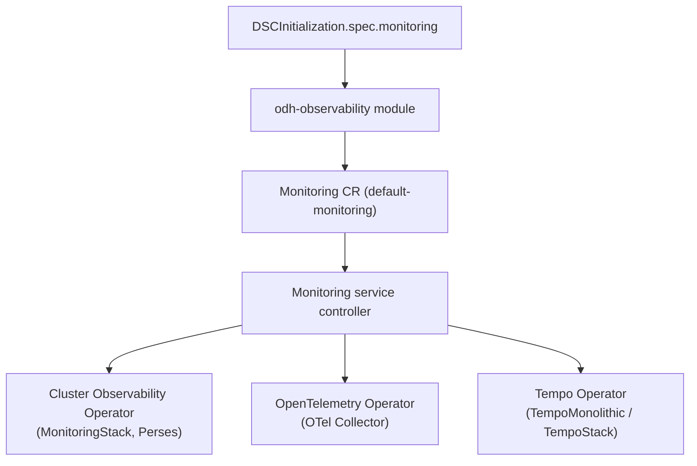

# RHOAI Observability Documentation Plan

> **Status:** Planning document — single source of truth for RHOAI 3.6 observability documentation work  
> **Owner:** TBD  
> **Last updated:** 2026-09-22  
> **Related user story:** Prerequisites, Observability Modes & Release Notes

---

## 1. Purpose

This document defines **what** we will document, **how** each user-story acceptance criterion maps to deliverable content, and **how** we validate it. It is the authoritative reference for writers, reviewers, and engineers before content is handed to the docs team.

### 1.1 Decisions (agreed 2026-09-10)

| Topic | Decision |
|-------|----------|
| **Document count** | **One** draft document covering all ACs. Final structure (chapters, split, placement) is for the **docs team** — not specified in the user story. |
| **Tone / length** | **Concise, not verbose.** Follow the style and depth of [RHOAI 3.5 — Manage observability](https://docs.redhat.com/en/documentation/red_hat_openshift_ai_self-managed/3.5/html/managing_openshift_ai/managing-observability_managing-rhoai): short intro, prerequisites, procedure, example YAML, verification. Extend with four modes — do not rewrite everything 3.5 already covers. |
| **Validation** | **Helm (2026-09-22 + Mode 2 complete 2026-09-27):** Mode 1 — metrics/traces/Perses + logs e2e Pass (DSCI/chart still do not project `logs`). Mode 2 — **Complete**. Mode 3 — Pass. Mode 4 — metrics/traces Pass (Perses with traces). |
| **Gaps (code vs AC)** | **Discuss and track** in [§8](#8-open-questions-and-implementation-gaps). Do not block writing; resolve before final publish. |
| **CLO** | **CLO** = **Cluster Logging Operator** (OperatorHub: **Red Hat OpenShift Logging Operator**, package `cluster-logging`). Handles log collection/forwarding via `ClusterLogForwarder`. Separate from OTel (metrics/traces). |
| **Downstream publish** | Out of scope for this plan. We produce draft content; docs team decides how to publish for 3.6 EA2. |
| **Release notes dashboards** | Observability dashboards move TP → GA in **RHOAI 3.6 EA2** (not 3.5 — original AC wording was wrong). Dashboard **names** still seeded from **3.5 product docs** §12.2.1. 3.5 TP chapter listing features as TP is consistent with this correction. |
| **Deviations & gaps** | **Log everything** that does not match AC, 3.5 docs, or expected behavior in [§8.5 — Deviation log](#85-deviation-log). AC vs cluster, code vs doc, 3.5 doc contradictions — all go here. |
| **No workarounds** | On any blocker, mismatch, or surprise: **stop, log in §8.5, report to owner**. Do **not** invent workarounds, config hacks, or doc fiction. Wait for decision before continuing that section. |
| **Mode 2 telemetry proof** | No external backend (Grafana Cloud, Dynatrace, etc.) required. Configure OTel Collector with a **debug/logger exporter** in the DSCI `metrics.exporters` / `traces.exporters`; verify data flows by checking **collector logs/output**. Same pattern as e2e `debug` exporter tests. |
| **Dashboard verification (Mode 1)** | **Two layers** at end of validation (Phase 4): (1) **CLI** — Perses pod, `PersesDashboard` CRs `Available=True`, datasources; (2) **Visual** — OpenShift AI → **Observe & monitor → Dashboard**, confirm expected tabs load (Cluster, Models, etc.). CLI alone is not enough (e.g. COO wrong namespace → CRs healthy but UI shows “No dashboards found”). |
| **Operator + monitoring install (customer-facing)** | **Primary path:** `rhai-on-openshift-chart` from [opendatahub-io/odh-gitops](https://github.com/opendatahub-io/odh-gitops) (`main`) or OCI `oci://registry.redhat.io/rhai/rhai-on-openshift-chart` (`v3.6`). **Recommended:** chart manages **both** dependency operators **and** DSCI (`services.monitoring.dsci.*`) — simplifies install. **Optional (not recommended for customers):** deps-only via `dependencies.*.enabled=true` with DSC/DSCI opt-out (chart flag TBD) for existing clusters. **Out of chart:** CLO and Loki — OperatorHub/manual. |
| **OpenShift AI app (DSC dashboard)** | **Required** for UI validation and normal product use: `components.dashboard.dsc.managementState=Managed` in all mode Helm values. Distinct from Perses observability dashboards (Mode 1 / Mode 4). Mode 2 still needs the RHOAI app Managed to verify Observe & monitor has **no** Perses dashboards. |
| **DSCI** | **Data Science Cluster Initialization** — the `DSCInitialization` CR (`default-dsci`). Chart template: `odh-gitops` `templates/operator/dscinitialization.yaml` projects `services.monitoring.dsci` → `spec.monitoring`. |
| **Validation install path** | **Helm** via **Quay** (`oci://quay.io/rhoai/rhai-on-openshift-chart`, e.g. `v3.6.0-ea.2`) + matching Quay/operator images — **this is the EA validation path**. GA later uses `registry.redhat.io`. Mode 2 exporters-only **Complete** on that path. Do **not** treat Quay EA vs “catalog stock” as an open Mode 2 blocker in status updates. |

### Goals

1. Document the **four observability deployment modes** with accurate operator prerequisites and setup steps.
2. Document **per-mode Helm values** (`services.monitoring.dependencies` + `services.monitoring.dsci`) for all four modes **and** OperatorHub for CLO/Loki.
3. Validate on cluster after teardown; **stop and report** on deviation (§8.5) — no workarounds.
4. Add a **RHOAI 3.6 EA2 release-notes section** announcing the GA promotion of observability dashboards (TP in 3.5 → GA in **3.6 EA2**).

### Out of scope (for this plan)

- Implementation changes to operator prerequisite checks (tracked separately if product intent diverges from code).
- Dashboard UI content or odh-dashboard repo documentation (referenced, not authored here).
- ODH community documentation (may mirror RHOAI content where applicable).

---

## 2. User story & acceptance criteria traceability

| AC | Requirement | Deliverable | Status |
|----|-------------|-------------|--------|
| Mode 1 | Document COO, OTel Operator, Tempo Operator, Loki Operator, and OpenShift Logging Operator as GA prerequisites with setup instructions | [§4.1](#41-mode-1--all-built-in-observability-enabled) + [§3.5](#35-operator-prerequisite-install--helm-chart) + [§6](#6-operator-prerequisite-reference) + [§7](#7-deliverable--single-document-outline) | **Helm:** five prereqs Succeeded; metrics/traces stack Pass; logs e2e Pass via Monitoring CR + S3 (not via DSCI/chart). |
| Mode 2 | Document opentelemetry-operator and OpenShift Logging Operator as sole prerequisites | [§4.2](#42-mode-2--external-observability-only) + [§3.5](#35-operator-prerequisite-install--helm-chart) | **Complete** (2026-09-27) — see `docs/OBSERVABILITY.md` §4 |
| Mode 3 | State clearly that no observability operator prerequisites are required | [§4.3](#43-mode-3--no-observability) + [§3.5](#35-operator-prerequisite-install--helm-chart) | **Complete** (CLI + UI 2026-09-27) |
| Mode 4 | Map each internal capability to required operators (metrics, tracing, logs, dashboards) | [§4.4](#44-mode-4--custom) + [§3.5](#35-operator-prerequisite-install--helm-chart) | **Complete** (CLI + UI 2026-09-27); D-008 open (Perses + broken Cluster/Models on traces-only) |
| Release notes | Dedicated section: TP observability dashboards → GA in RHOAI **3.6 EA2** | [§5](#5-release-notes-content) | Draft updated in `docs/OBSERVABILITY.md` §8 (corrected from mistaken 3.5) |
| Helm (all modes) | Per-mode values files via `services.monitoring.*` | [§3.5](#35-install-with-helm-chart-rhai-on-openshift) + `docs/OBSERVABILITY.md` §2.1 | **Done** — Helm cluster validation recorded in doc |

---

## 3. Background — how observability works in RHOAI

### 3.1 Configuration surface

Observability is configured on **`DSCInitialization.spec.monitoring`** (`DSCIMonitoring`). There is **no named “mode” enum** in the API; modes are **derived combinations** of:

| Field | Purpose |
|-------|---------|
| `managementState` | `Managed` (module active) or `Removed` (no observability module) |
| `namespace` | Monitoring operand namespace (`redhat-ods-monitoring` on RHOAI) |
| `metrics` | Built-in Prometheus stack and/or external metrics exporters |
| `metrics.storage` | Enables built-in metrics storage (MonitoringStack via COO) |
| `metrics.exporters` | Custom OTel exporter pipelines to external backends |
| `traces` | Built-in Tempo tracing and/or external trace exporters |
| `traces.storage` | Tempo backend (`pv`, `s3`, or `gcs`) |
| `traces.exporters` | Custom OTel trace exporter pipelines |

**Source:** `api/services/v1alpha1/monitoring_types.go`, `internal/controller/modules/monitoring/handler.go`

### 3.2 Architecture (high level)


```mermaid
flowchart TD
  DSCI["DSCInitialization.spec.monitoring"]
  Module["odh-observability module"]
  MonCR["Monitoring CR (default-monitoring)"]
  MonCtrl["Monitoring service controller"]
  COO["Cluster Observability Operator\n(MonitoringStack, Perses)"]
  OTel["OpenTelemetry Operator\n(OTel Collector)"]
  Tempo["Tempo Operator\n(TempoMonolithic / TempoStack)"]

  DSCI --> Module --> MonCR --> MonCtrl
  MonCtrl --> COO
  MonCtrl --> OTel
  MonCtrl --> Tempo
```

### 3.3 Operator-enforced prerequisites (today)

The monitoring controller checks for these operators via `OperatorCondition` CRs:

| Operator | Package name (detection) | Subscription name (e2e) | Namespace | Required when |
|----------|--------------------------|---------------------------|-----------|---------------|
| **Cluster Observability Operator (COO)** | `cluster-observability-operator` | `cluster-observability-operator` | `openshift-cluster-observability-operator` | `metrics != null` |
| **OpenTelemetry Operator** | `opentelemetry-operator` | `opentelemetry-product` | `openshift-opentelemetry-operator` | `metrics != null` **or** `traces != null` |
| **Tempo Operator** | `tempo-operator` | `tempo-product` | `openshift-tempo-operator` | `traces != null` |

**Status messages:** `internal/controller/status/status.go`  
**Precondition logic:** `internal/controller/services/monitoring/monitoring_controller_support.go` (`checkMonitoringPreconditions`)

> **Important:** **Loki Operator** and **OpenShift Logging Operator** are **not enforced** by the opendatahub-operator monitoring controller today. They appear in the user story as **product prerequisites** for log observability and external-only deployments. Document them per AC; flag the enforcement gap in [§8](#8-open-questions-and-implementation-gaps).

### 3.4 Perses / dashboards

Built-in observability dashboards are delivered via **Perses** CRs managed through **COO** (Perses CRDs: `perses.dev`). There is **no separate Perses Operator prerequisite check** in code. The current `README.md` lists a standalone “Perses Operator” — that entry should be **corrected** in the new docs.

Dashboard GA/TP lifecycle is **not tracked in this repo**; coordinate with **odh-dashboard** and product docs for the authoritative list. **GA timing: RHOAI 3.6 EA2** (not 3.5).

### 3.5 Install with Helm chart (`rhai-on-openshift-chart`)

**Customer-facing path.** Chart: `oci://registry.redhat.io/rhai/rhai-on-openshift-chart` (source: [odh-gitops](https://github.com/opendatahub-io/odh-gitops) `charts/rhai-on-openshift-chart`). Requires `helm registry login registry.redhat.io`. **`CHART_VERSION=v3.6`** per user story.

**Authoritative customer doc:** `docs/OBSERVABILITY.md` §2.1 (per-mode values files).

#### Two Helm value layers

| Layer | Values | Effect |
|-------|--------|--------|
| **Operators** | `services.monitoring.dependencies.{clusterObservability,opentelemetry,tempo}` | When monitoring service is `Managed`, chart installs matching OLM subscriptions |
| **DSCI** | `services.monitoring.dsci.{managementState,metrics,traces,alerting}` | Projected to `default-dsci` `spec.monitoring` |

#### Dependency resolution (same as components — official chart doc)

Chart reference: [How Component Dependencies Work](https://github.com/opendatahub-io/odh-gitops/tree/main/charts/rhai-on-openshift-chart#how-component-dependencies-work) — applies to **`services`** the same way as **`components`**.

| Components | Services (monitoring) |
|------------|----------------------|
| `components.*.dsc.managementState` | `services.monitoring.dsci.managementState` |
| `components.*.dependencies.*` (boolean) | `services.monitoring.dependencies.*` (boolean) |
| → `DataScienceCluster` | → `DSCInitialization.spec.monitoring` |

**Resolution flow:** (1) service active (`Managed`/`Unmanaged`) → (2) `services.monitoring.dependencies.<name>=true` → (3) top-level `dependencies.<name>.enabled` is `auto` or `true` → install.

**Tri-state** (`dependencies.<name>.enabled`): `false` = never; `true` = always; `auto` = only when flow above matches.

**When chart manages DSCI:** set `services.monitoring.dependencies.*` per mode; keep top-level `dependencies.*.enabled=auto`.

**Operators only:** `dsci.managementState=Removed` + `dependencies.<name>.enabled=true` — see chart [install dependency without component](https://github.com/opendatahub-io/odh-gitops/tree/main/charts/rhai-on-openshift-chart#example-install-a-dependency-without-a-component).

#### Chart source

| Path | `helm registry login`? |
|------|------------------------|
| OCI `oci://registry.redhat.io/rhai/rhai-on-openshift-chart` | **Yes** — pull chart only |
| Git clone → `./charts/rhai-on-openshift-chart` | **No** |

#### Mode → Helm values (summary)

| Mode | `dsci.managementState` | `dependencies` (monitoring) | `dsci` content | Manual |
|------|------------------------|----------------------------|----------------|--------|
| **1** | `Managed` | COO, OTel, Tempo `true` | `metrics.storage` + `traces.storage` | CLO, Loki |
| **2** | `Managed` | OTel `true`; COO, Tempo `false` | `metrics.exporters`, `traces.exporters` | CLO |
| **3** | `Removed` | all `false` | — | — |
| **4** | `Managed` | per pillar | per pillar (`storage` / `exporters`) | CLO+Loki if logs |

Full YAML: `docs/OBSERVABILITY.md` §2.1 (`values-mode{1,2,3,4}-*.yaml`).

#### Mode 2 — exporters-only (resolved)

- **Helm** installs OTel and writes Mode 2 DSCI via values — **supported by chart**.
- Exporters-only admission (**D-004**, **D-005**) — **Resolved**; re-validated **2026-09-27** on Quay EA chart/images. Mode 2 **Complete** (CLI + UI).

#### Two-phase Helm (CRD bootstrap)

First run may create Subscriptions only; re-run after CSVs `Succeeded`. Do not use `helm install --wait`. See [Red Hat GitOps article](https://developers.redhat.com/articles/2026/08/26/automating-red-hat-openshift-ai-installations-with-helm-and-gitops).

#### Verification

| Check | Command |
|-------|---------|
| RHOAI CSV | `oc get csv -n redhat-ods-operator` |
| COO / OTel / Tempo CSV | respective operator namespaces |
| DSCI | `oc get dsci default-dsci -o yaml` |
| Operands | `oc get pods -n redhat-ods-monitoring` |
| Mode 2 collector | collector pod logs (when DSCI reconciles) |

---

## 4. Four observability deployment modes

Each mode below defines: **intent**, **DSCI configuration**, **required operators**, **deployed operands**, and **documentation checklist**.

### 4.1 Mode 1 — All built-in observability enabled

**Intent:** Full RHOAI observability stack — metrics, traces, logs, and dashboards — using platform-managed storage and UI.

#### Required operator prerequisites (GA)

| Operator | Role in RHOAI observability |
|----------|----------------------------|
| **Cluster Observability Operator (COO)** | MonitoringStack (Prometheus), Thanos querier, Perses dashboards |
| **OpenTelemetry Operator** | OTel Collector deployment and instrumentation |
| **Tempo Operator** | Tempo trace storage (Monolithic PV or TempoStack S3/GCS) |
| **Loki Operator** | Log aggregation backend for built-in log observability |
| **OpenShift Logging Operator (CLO)** | Cluster log collection and forwarding infrastructure |

> **Helm (COO + Tempo + OTel):** [§3.5](#35-operator-prerequisite-install--helm-chart) — kitchen-sink `--set` flags.  
> **OperatorHub (CLO + Loki):** [§6.4](#64-loki-operator), [§6.5](#65-openshift-logging-operator-clo) — chart does **not** install these.

#### Example DSCI configuration

```yaml
apiVersion: dscinitialization.opendatahub.io/v2
kind: DSCInitialization
metadata:
  name: default-dsci
spec:
  applicationsNamespace: redhat-ods-applications
  monitoring:
    managementState: Managed
    namespace: redhat-ods-monitoring
    metrics:
      replicas: 2
      storage:
        size: 5Gi
        retention: 90d
    traces:
      sampleRatio: "0.1"
      storage:
        backend: pv
        size: 5Gi
        retention: 2160h
```

**Reference:** `README.md` Example DSCInitialization; RHOAI sample at `config/rhoai/samples/dscinitialization_v2_dscinitialization.yaml`

#### Deployed operands (built-in path)

| Capability | Operand / integration | Depends on |
|------------|----------------------|------------|
| Metrics | MonitoringStack, ThanosQuerier, OTel Collector | COO, OTel Operator |
| Tracing | Tempo (Monolithic/Stack), OTel Collector pipelines | Tempo Operator, OTel Operator |
| Dashboards | Perses instance, datasources, dashboard CRs | COO |
| Logs | Loki stack + CLO collection (product) | Loki Operator, CLO |

#### Documentation checklist

- [ ] Prerequisites table listing all five GA operators
- [ ] Helm kitchen-sink command (COO + Tempo; OTel transitive) + OperatorHub steps for CLO + Loki
- [ ] Per-operator install section (Helm flags for chart-supported operators; subscription YAML for CLO/Loki)
- [ ] Recommended install order: **Helm** (RHOAI + COO/OTel/Tempo) → CLO → Loki → **then** DSCI monitoring config
- [ ] Post-prerequisite validation (operator CSV `Succeeded` for all five)
- [ ] Post-DSCI validation (`Monitoring` CR Ready, operands, dashboards)
- [ ] Link to namespace-restricted metrics doc: `docs/NAMESPACE_RESTRICTED_METRICS.md`
- [ ] Link to accelerator metrics doc: `docs/ACCELERATOR_METRICS.md`
- [ ] Storage sizing guidance (default 5Gi metrics / 90d retention; 5Gi PV traces)

---

### 4.2 Mode 2 — External observability only

**Intent:** RHOAI forwards telemetry to **existing** enterprise observability backends. Minimal platform footprint; no reliance on built-in Prometheus/Tempo storage.

#### Required operator prerequisites (per user story)

| Operator | Role |
|----------|------|
| **OpenTelemetry Operator** | Deploy OTel Collector with custom exporter pipelines |
| **OpenShift Logging Operator (CLO)** | Cluster log collection for external log pipelines |

> **Do not** list COO, Tempo, or Loki as required for this mode in the published guide.

#### Target DSCI configuration (product intent)

```yaml
spec:
  monitoring:
    managementState: Managed
    namespace: redhat-ods-monitoring
    metrics:
      exporters:
        otlp/external:
          endpoint: https://metrics.example.com:4317
          tls:
            insecure: false
    traces:
      storage:
        backend: pv   # TBD — see §8.1
        size: 1Gi
      exporters:
        otlp/external:
          endpoint: https://traces.example.com:4317
```

#### Documentation checklist

- [ ] State explicitly: **no built-in Prometheus, Tempo, Loki, or Perses dashboards**
- [ ] Document OTel Collector exporter configuration format (OpenTelemetry Collector schema)
- [ ] Document CLO integration for log forwarding to external systems
- [ ] Provide example exporter configs for common backends (Dynatrace, Grafana Cloud, Splunk OTLP — confirm with PM)
- [ ] Validation: OTel Collector pods running, metrics/traces visible in external backend

#### ⚠️ Code alignment note

Mode 2 exporters-only validated **current** behavior (2026-09-27). Customer doc in `docs/OBSERVABILITY.md` §4.

---

### 4.3 Mode 3 — No observability

**Intent:** RHOAI deployed without any observability module or external observability prerequisites.

#### Configuration

```yaml
spec:
  monitoring:
    managementState: Removed
```

Alternatively, `managementState: Managed` with **no effective metrics or traces** (empty `metrics: {}` and no `traces`) runs the observability module shell but deploys **no operands** and performs **no operator prerequisite checks**.

#### Required operator prerequisites

**None.**

#### Documentation checklist

- [ ] Bold callout: no observability operators required before RHOAI install
- [ ] Explain trade-offs: no platform metrics/traces/dashboards in RHOAI UI
- [ ] Note: individual components may still expose app-level metrics independently
- [ ] Document how to enable observability later (upgrade path to Mode 1 or 4)

---

### 4.4 Mode 4 — Custom

**Intent:** Mix built-in and external capabilities — enable only the observability pillars the administrator needs.

#### Capability → operator mapping (per user story)

| Capability | Internal (built-in) | Required operators | Optional / external |
|------------|--------------------|--------------------|---------------------|
| **Metrics** | MonitoringStack + OTel Collector | **COO**, **OpenTelemetry Operator** | Custom `metrics.exporters` |
| **Tracing** | Tempo + OTel Collector | **OpenTelemetry Operator**, **Tempo Operator** | Custom `traces.exporters` |
| **Logs** | Loki-based log observability | **OpenShift Logging Operator**, **Loki Operator** | External log sinks via CLO |
| **Dashboards** | Perses dashboards in RHOAI | **COO** | N/A (dashboards require COO/Perses) |

#### Decision matrix for administrators

```
Need metrics?     → Install COO + OpenTelemetry Operator; set metrics.storage and/or metrics.exporters
Need tracing?     → Install OpenTelemetry Operator + Tempo Operator; configure traces.storage and/or traces.exporters
Need logs?        → Install OpenShift Logging Operator + Loki Operator
Need dashboards?  → Install COO (includes Perses CRDs)
```

#### Example: metrics + external exporter only

```yaml
spec:
  monitoring:
    managementState: Managed
    metrics:
      storage:
        size: 10Gi
        retention: 30d
      exporters:
        prometheusremotewrite/external:
          endpoint: https://prometheus.example.com/api/v1/write
```

**Operators required:** COO, OpenTelemetry Operator  
**Operators not required:** Tempo Operator, Loki Operator, CLO

#### Example: traces only (built-in PV)

```yaml
spec:
  monitoring:
    managementState: Managed
    traces:
      storage:
        backend: pv
        size: 5Gi
```

**Operators required:** OpenTelemetry Operator, Tempo Operator  
**Operators not required:** COO (unless metrics also enabled), Loki Operator, CLO

#### Documentation checklist

- [ ] Capability matrix table (above) as primary reference
- [ ] Per-capability mini-guides with DSCI snippets
- [ ] “Minimum operator set” worked examples (3–4 scenarios)
- [ ] Cross-link to troubleshooting: `docs/troubleshooting.md` (OTel Collector, MonitoringStack alerts)

---

## 5. Release notes content

### 5.1 Placement

| Document | Location | Audience |
|----------|----------|----------|
| **RHOAI 3.6 Release Notes** | Red Hat product docs (downstream); draft section in this repo TBD | Administrators, SREs |
| **RHOAI 3.6 Installation Guide — Observability** | Product install guide + upstream `docs/` mirror | Installers |

### 5.2 Required release-notes section (draft outline)

**Title:** Observability dashboards reach General Availability

**Body (draft — finalize with PM/dashboard team):**

> In Red Hat OpenShift AI **3.6 EA2**, observability dashboards that were previously **Technology Preview (TP)** in **3.5** transition to **General Availability (GA)**. RHOAI **3.6** documentation also introduces explicit guidance for four observability deployment modes.
>
> **What changed in 3.6 EA2:**
> - Observability dashboards are now GA-supported for production use.
> - Dashboard visualization continues to be powered by Perses (via Cluster Observability Operator).
> - Four observability deployment modes with operator prerequisite matrices.
> - Per-mode installation and configuration instructions.
> - Clarified GA status for observability platform operators (COO, OpenTelemetry Operator, Tempo Operator, Loki Operator, OpenShift Logging Operator).

### 5.3 Dashboard GA inventory (names from RHOAI 3.5 docs; GA in 3.6 EA2)

Release notes: dashboards previously TP are **GA since RHOAI 3.6 EA2**. Seed **names** from [3.5 §12.2.1 — Available dashboards](https://docs.redhat.com/en/documentation/red_hat_openshift_ai_self-managed/3.5/html/managing_openshift_ai/managing-observability_managing-rhoai). 3.5 TP chapter still listing features as TP is **correct** (GA was not 3.5).

| Dashboard | Notes |
|-----------|-------|
| Cluster | Cluster admin only |
| Models | Namespace-scoped for all users |
| Usage | MaaS token/request metrics |
| LLM Traffic | llm-d |
| LLM Performance | llm-d |
| LLM Utilization | llm-d |

---

## 6. Operator prerequisite reference

Standard content block to reuse across modes. Final channel names and versions must match the RHOAI 3.6 supported OpenShift release (4.19+ per `README.md`).

### 6.1 Cluster Observability Operator (COO)

| Property | Value |
|----------|-------|
| Purpose | MonitoringStack (Prometheus), Thanos, Perses dashboards |
| OperatorHub name | `cluster-observability-operator` |
| Namespace | `openshift-cluster-observability-operator` |
| Required for | Built-in metrics, dashboards |

**Install (outline):**

```yaml
apiVersion: operators.coreos.com/v1alpha1
kind: Subscription
metadata:
  name: cluster-observability-operator
  namespace: openshift-cluster-observability-operator
spec:
  channel: stable   # confirm for target OCP version
  name: cluster-observability-operator
  source: redhat-operators
  sourceNamespace: openshift-marketplace
  installPlanApproval: Automatic
```

**Validation:** CSV `Succeeded`; `OperatorCondition` for `cluster-observability-operator` reports available.

---

### 6.2 OpenTelemetry Operator

| Property | Value |
|----------|-------|
| Purpose | OTel Collector, instrumentation CRs |
| OperatorHub name | `opentelemetry-product` |
| Namespace | `openshift-opentelemetry-operator` |
| Required for | Any metrics or traces configuration |

**Install (outline):** Same Subscription pattern as above with `name: opentelemetry-product`.

**Validation:** CSV `Succeeded`; collector CRs reconcile after RHOAI monitoring enabled.

---

### 6.3 Tempo Operator

| Property | Value |
|----------|-------|
| Purpose | Tempo trace storage |
| OperatorHub name | `tempo-product` |
| Namespace | `openshift-tempo-operator` |
| Required for | Built-in traces (`traces` block present) |

---

### 6.4 Loki Operator

| Property | Value |
|----------|-------|
| Purpose | Log aggregation for built-in log observability |
| OperatorHub name | _TBD — confirm package name_ |
| Required for | Built-in logs (Mode 1; Mode 4 logs pillar) |

> **Action item:** Confirm OperatorHub package name, namespace, and GA channel for RHOAI 3.6.

---

### 6.5 OpenShift Logging Operator (CLO)

| Property | Value |
|----------|-------|
| Full name | Red Hat OpenShift Logging Operator (abbreviated **CLO**) |
| Purpose | Cluster log collection and forwarding (`ClusterLogForwarder`) |
| OperatorHub name | `cluster-logging` (confirm channel on target OCP) |
| Required for | Mode 1 (all built-in); Mode 2 (external logs); Mode 4 logs pillar |
| Detail level in our doc | Brief prerequisite + link to [OpenShift Logging install docs](https://docs.redhat.com/en/documentation/red_hat_openshift_logging/6.6/html/installing_logging/overview-of-openshift-logging-installation) — do not duplicate full CLO/Loki install guide |

> **Open question:** CLO 6.x / LokiStack channel pairing for target OCP version — confirm during validation run.

---

### 6.6 Helm chart — operator prerequisites (`rhai-on-openshift-chart`)

**Authoritative content:** [§3.5](#35-operator-prerequisite-install--helm-chart) (commands, mode → values table, two-phase install, CSV verification) + `docs/OBSERVABILITY.md` §2.1.

| Property | Value |
|----------|-------|
| Chart | `oci://registry.redhat.io/rhai/rhai-on-openshift-chart` |
| Auth | `helm registry login registry.redhat.io` |
| Monitoring values | `services.monitoring.dependencies.*`, `services.monitoring.dsci.*` |
| Top-level deps | `dependencies.{clusterObservability,opentelemetry,tempo}.enabled` |
| Chart README | [How Component Dependencies Work](https://github.com/opendatahub-io/odh-gitops/tree/main/charts/rhai-on-openshift-chart#how-component-dependencies-work) (same for services) |
| Not in chart | CLO, Loki — use [§6.4](#64-loki-operator), [§6.5](#65-openshift-logging-operator-clo) |
| Customer doc section | `docs/OBSERVABILITY.md` §2.1 |

---

## 7. Deliverable — single document outline

**One draft:** [`docs/OBSERVABILITY.md`](docs/OBSERVABILITY.md). Modeled on RHOAI 3.5 Chapter 12 length/style — **extend, don't replace** the existing observability chapter.

### 7.1 Proposed sections

| # | Section | Covers AC | Notes |
|---|---------|-----------|-------|
| 1 | **Introduction** | All | 2–3 sentences: what observability is in RHOAI; four deployment modes exist |
| 2 | **Choose your deployment mode** | All | One decision table (Appendix A matrix) + 1 paragraph per mode |
| 2.1 | **Install with Helm (all modes)** | All modes | OCI chart v3.6, `services.monitoring.*` values files per mode; CLO/Loki OperatorHub |
| 3 | **Mode 1 — All built-in** | Mode 1 | Helm `values-mode1-builtin.yaml` + CLO/Loki; verification (pods + dashboards) |
| 4 | **Mode 2 — External only** | Mode 2 | Prerequisites (OTel + CLO), DSCI exporters YAML, verification (OTLP endpoint + log forwarder) |
| 5 | **Mode 3 — No observability** | Mode 3 | `managementState: Removed`; no operator prerequisites; trade-offs (1 short paragraph) |
| 6 | **Mode 4 — Custom** | Mode 4 | Capability → operator matrix + 2–3 minimal DSCI examples |
| 7 | **Operator reference** | Mode 1, 4 | Compact table per operator: package name, namespace, subscription snippet — reuse [§6](#6-operator-prerequisite-reference) |
| 8 | **Release notes — Observability dashboards GA** | Release notes AC | Short section: dashboards TP → GA in 3.5; list from §5.3; what's new in 3.6 docs (four modes) |

**Not in scope for verbosity:** Full dashboard metric tables (already in 3.5 §12.2), full CLO/Loki install guide, workload scrape labeling (link to 3.5 §12.3).

### 7.2 Supporting updates (same effort, not separate docs)

| Item | Change |
|------|--------|
| `config/rhoai/samples/dscinitialization_v2_dscinitialization.yaml` | Commented DSCI examples per mode |
| `README.md` | Fix Perses Operator row; link to observability draft; mode-aware prerequisite summary |
| `observability-documentation-plan.md` | This plan — kept in sync as decisions land |

---

## 8. Open questions and implementation gaps

Resolve before final publish. Track decisions in this section.

### 8.1 Mode 2 (external only) vs operator behavior

**Resolved for validation (2026-09-27, Quay EA path):** exporters-only DSCI applies; OTel collectors Running; no MonitoringStack / Tempo / Perses; UI has no Observe & monitor. Mode 2 **Complete**.

| Topic | Outcome |
|-------|---------|
| COO / MonitoringStack | Not required for exporters-only; none deployed |
| Traces without Tempo | Works with `traces.exporters` only (no `traces.storage`) |
| Metrics exporters only | Works; collectors Running |

### 8.2 Loki and OpenShift Logging Operator

Not referenced in monitoring precondition checks. Confirm:

1. Are Loki/CLO prerequisites for **RHOAI dashboard log views** only (outside operator reconcile)?
2. Should the operator add precondition checks in a future release?
3. What CLO/Loki version pairs are supported with RHOAI 3.6?

### 8.3 Dashboard GA list

**Resolved (product correction 2026-09-27):** Dashboards are **GA in RHOAI 3.6 EA2**, not 3.5. Original user-story “GA in 3.5” was a mistake. 3.5 TP chapter remaining TP is consistent. Release-notes draft in `docs/OBSERVABILITY.md` §8 updated.

### 8.4 Missing referenced doc

`docs/NAMESPACE_RESTRICTED_METRICS.md` references `docs/MONITORING_RBAC.md`, which does not exist. Either create it or fix the link during this doc pass.

### 8.5 Deviation log

**Living record** of everything that does not line up. Add a row as soon as it is found — during validation, writing, or review. **Do not work around; report.**

| ID | Phase / mode | Expected (AC or 3.5 doc) | Observed | Status | Reported |
|----|--------------|--------------------------|----------|--------|----------|
| D-001 | Phase 0 | RHOAI 3.6 EA2 on validation cluster | Installed; later redone via Helm chart path | **Resolved** | Yes |
| D-003 | Phase 0 | Auto-created DSCI uses RHOAI monitoring namespace `redhat-ods-monitoring` | Auto DSCI with wrong platform binary used `opendatahub`; RHOAI defaults `redhat-ods-monitoring` | **Resolved** on RHOAI image / Helm path | Yes |
| D-004 | Mode 2 — External only | `traces.exporters` without `traces.storage` | Earlier webhook required `traces.storage` | **Resolved** (2026-09-27) — exporters-only allowed; **Pass** on Quay EA validation path | Yes |
| D-005 | Mode 2 — External only | `metrics.exporters` only (no storage) | Earlier CollectorReplicas CEL blocked exporters-only | **Resolved** (2026-09-27) — collectors Running; **Pass** on Quay EA validation path | Yes |
| D-006 | Mode 1 — All built-in | `odh-observability` module deploys to `redhat-ods-applications` | Platform provisioning failed with wrong image/env | **Resolved** on RHOAI / Helm path | Yes |
| D-007 | Phase 0 | README RHOAI direct deploy | Dev deploy path ambiguity | **Resolved** — customer path = Helm (§3.5) | Yes |
| D-009 | Validation | Customer install via Helm + `services.monitoring` | Helm validation completed 2026-09-22; **`docs/OBSERVABILITY.md` = Helm results only** | **Resolved** | Yes |
| D-010 | Infra | Cluster capacity for validation | Workers scaled; schedulable before Helm run | **Resolved** | Yes |
| D-011 | Helm Phase 0 | Fresh Helm on leftover cluster | Non-Helm-owned NS/DSCI; cleanup required | **Resolved** | Yes |
| D-012 | Helm Mode 3 — None | RHOAI **3.6** per user story | OperatorHub has no 3.6; **EA only:** CatalogSource from internal FBC + Helm source override. **Do not put in customer docs.** | **Resolved for EA validation** | Yes |
| D-013 | Helm pass 2 | DSC from chart Quay `v3.6.0-ea.2` | Pass 2 OK on 3.6 CSV + v2 CRDs | **Resolved** | Yes |
| D-014 | Helm validation | Customer path = `opendatahub-io/odh-gitops` | Avoided internal fork branch for customer docs | **Fixed in docs** | No |
| D-015 | Helm Mode 3 — None (2026-09-22) | Quay OCI Mode 3 | Pass 1+2: DSCI Removed, DSC Ready, Helm deployed | **Resolved** | Yes |
| D-008 | Mode 4 — Custom (traces only) | Expectation: no Perses / no Observe & monitor if dashboards pillar off | **UI 2026-09-27:** Observe & monitor still present. Perses + `tempo-datasource` + `data-science-tempo-traces`. Cluster/Models tabs stay (Dashboard-owned) but error: missing `cluster-prometheus-datasource` (`PersesPrometheusDataSourceAvailable=False`). **Clarify AC:** Perses-for-Tempo OK? Should Cluster/Models hide when metrics off? | **Open — AC/product intent** | Yes |
| D-016 | Mode 1 — All built-in (logs) | CLO+Loki prereqs + log forwarding active | CLO+Loki Succeeded. Forwarding e2e **Pass** after Monitoring `spec.logs` + S3 secret (`rhoai-logs-s3`); LokiStack+CLF Available; collectors need privileged PSA (+ `enforce-version=latest`, `scc.podSecurityLabelSync=false`); marker in Loki `application` tenant. **Remaining gap:** DSCI v2 / chart Mode 1 values do not project `logs` — customer must patch Monitoring CR. | **Resolved** for e2e; **Open** for Helm/DSCI projection | Yes |

**Status values:** `Open` → `Discussing` → `Resolved` (doc updated) / `Accepted` (AC changed) / `Deferred` (out of scope)

**Triggers to log and stop:**

- Operator prerequisite differs from user story AC
- Operand deploys when AC says it should not (e.g. MonitoringStack in Mode 2)
- Verification step fails
- 3.5 docs contradict each other or the user story
- Missing operator, wrong channel, reconcile error
- Anything that would require a workaround to make the doc or test “pass”

---

## 9. Validation — single-run plan

> **Helm validation:** Modes 1–4 via **Quay** EA chart/images (`v3.6.0-ea.2`). Mode 2 exporters-only **Pass** (2026-09-27, CLI + UI). Mode 4 from scratch: metrics Pass; traces Pass (Perses with Tempo). UI Pass Modes 1–4 (2026-09-27). Validation evidence lives **only in this plan**, not in customer `docs/OBSERVABILITY.md`.

**Install path:** Helm on Quay EA (`rhai-on-openshift-chart` + per-mode values from `docs/OBSERVABILITY.md` §2.1).

One cluster, ordered phases. Each phase: **teardown → Helm** with mode values file → verify → log §8.5 on failure.

| Phase | Mode | **Helm values file** | Manual (OperatorHub) | Verify | Helm result (2026-09-22) |
|-------|------|---------------------|----------------------|--------|--------------------------|
| **0** | Baseline / teardown | Fresh cluster; `helm registry login` | — | Workers schedulable | Done |
| **1** | **3 — None** | `values-mode3-none.yaml` | — | `dsci` Removed; no observability deps | **Pass** |
| **2** | **2 — External** | `values-mode2-external.yaml` | CLO | OTel CSV; DSCI applies or **stop** | **Pass** (2026-09-27) — exporters-only; UI no Observe & monitor |
| **3** | **4 — Custom** | `values-mode4-metrics.yaml`, `values-mode4-traces.yaml` | Loki if logs | Operands match matrix | **From scratch:** metrics Pass; traces Pass (includes Perses/tempo-traces) |
| **4** | **1 — All built-in** | `values-mode1-builtin.yaml` | CLO + Loki + S3 secret | Full stack; five prereq CSVs | Metrics/traces **Pass**; CLO+Loki CSV **Pass**; logs e2e **Pass** (Monitoring CR `logs`, not Helm/DSCI) |
| **5** | Release notes | — | — | Finalize §5 / §7 | Draft in doc |

**Between modes:** Prefer Mode 3 — None (+ wait until monitoring pods gone) before next Mode 4 sub-case when proving from-scratch topology.

### 9.1 What we learn on the cluster (not pre-decisions)

These are **not** questions for you to answer upfront. We run the phase, observe, document. Mismatch → **§8.5 + report, stop that section.**

| Check | If mismatch |
|-------|----------------|
| Mode 2: only OTel + CLO installed; exporters-only DSCI | Log extra operands or missing operators (§8.1) |
| Mode 2: metrics/traces reach collector debug/logger exporter | Log failure; do not fake verification |
| Mode 2: logs forward via CLO | Log failure; do not fake verification |
| Mode 4: capability matrix matches deployed operands | Log per sub-case |
| Operator package names / channels on cluster OCP version | Log; fill §6 from observed values |
| Dashboard GA list vs 3.5 TP chapter | Log in §8.3 / §8.5 |
| Mode 1: dashboards in UI | Log §8.5 if CRs exist but UI empty or tabs missing |

### 9.2 Dashboard checks by mode

| Mode | Dashboard expectation | Verify |
|------|----------------------|--------|
| **1 — All built-in** | All built-in dashboards available | CLI + **visual** (§1.1) |
| **2 — External** | **No** built-in Perses dashboards in RHOAI UI | Confirm Observe & monitor has no / empty dashboard experience |
| **3 — None** | No observability UI | Confirm monitoring Removed |
| **4 — Custom** | Dashboards only if COO + metrics enabled | CLI + visual **only when dashboards pillar is in scope** for that sub-case |

---

## 10. Work breakdown

### Phase 0a — Install RHOAI + observability (Helm) — **customer path / doc validation**

```bash
# EA validation used Quay; GA docs use registry.redhat.io when v3.6 publishes
helm registry login quay.io   # or registry.redhat.io for GA
export CHART_VERSION=v3.6.0-ea.2

helm upgrade --install rhoai \
  oci://quay.io/rhoai/rhai-on-openshift-chart \
  --version ${CHART_VERSION} \
  -n rhoai-gitops --create-namespace \
  --set operator.type=rhoai \
  -f values-mode<N>.yaml   # see docs/OBSERVABILITY.md §2.1
```

Re-run after CSVs `Succeeded` (§3.5). Install CLO (+ Loki if needed) from OperatorHub when required.

- [x] Document per-mode values in `docs/OBSERVABILITY.md` §2.1
- [x] Helm registry login + chart pull (Quay EA)
- [x] Cluster capacity OK (D-010)
- [x] Run §9 phases 1–4 (Helm) — results in `docs/OBSERVABILITY.md`

### Phase 1 — Skeleton

- [x] Create single draft doc with section headers — `docs/OBSERVABILITY.md`
- [x] Add commented DSCI samples per mode — `config/rhoai/samples/dscinitialization_v2_dscinitialization.yaml`

### Phase 2 — Single validation run (§9) — Helm

- [x] Mode 3 — None: Pass
- [x] Mode 2 — External only: **Pass** (2026-09-27) — exporters-only DSCI + collectors; UI Observe & monitor absent
- [x] Mode 4 — Custom: metrics from scratch Pass; traces from scratch Pass (Perses+tempo-traces with Tempo — update AC if “no dashboards” was assumed)
- [x] Mode 4 — Custom: retest traces after Mode 3 clean (2026-09-22) — Perses is **not** switch-only leftover
- [x] Mode 1 — All built-in: metrics/traces Pass; COO/OTel/Tempo/Loki/CLO CSVs Succeeded; log forwarding e2e Pass (Monitoring CR `logs` + S3; privileged PSA; marker in Loki)
- [x] Logs forwarding e2e (LokiStack + ClusterLogForwarder) — validated via Monitoring CR; Helm/DSCI projection still missing (doc gap)
- [x] UI / OpenShift AI dashboard visual checks (Phase 2b) — Modes 1–4 done (2026-09-27); D-008 open for product

### Phase 2b — UI verification (OpenShift web console + OpenShift AI console)

**OpenShift AI console UI (required for validation — done)**

- [x] **Mode 1 — Dashboard navigation:** (2026-09-27) Observe & monitor → Dashboard; **Cluster** + **Models** tabs present
- [x] **Mode 1 — Dashboard content:** (2026-09-27) Tabs load (not “No dashboards found”); Models “No data” OK without model workloads
- [x] **Mode 2 — No built-in dashboards:** (2026-09-27) OpenShift AI app Managed; sidebar has **no** Observe & monitor
- [x] **Mode 3 — No observability UI:** (2026-09-27) Observe & monitor absent; RHOAI app remains
- [x] **Mode 4 — Custom:** (2026-09-27) metrics-only UI Pass; traces-only Observe & monitor still present (D-008)

**OpenShift web console click-paths** — **Not a user-story AC.** Plan-only polish inspired by 3.5 doc tone. Validation used Helm/`oc` + OpenShift AI UI. **Deferred / out of scope** for this pass.

- [x] ~~Console YAML apply / operand click-paths~~ — **Deferred** (not in user story ACs)
- [x] ~~Numbered OpenShift console Procedure rewrite in customer doc~~ — **Deferred** (not in user story ACs)

### Phase 3 — Finish & handoff

- [x] Release notes draft in `docs/OBSERVABILITY.md` §8 (GA in 3.6; four modes)
- [ ] README Perses → COO — tracked for product README separately; **reverted** from this docs pass (not our deliverable)
- [x] Helm install + customer verification steps in `docs/OBSERVABILITY.md` (validation tables stay in this plan only)
- [ ] Technical review (monitoring/observability owners)
- [ ] Hand draft to docs team
- [x] UI visual checks (Phase 2b) — Modes 1–4 done 2026-09-27
- [x] CLO logs pipeline validation
- [x] Mode 2 — **Complete** on Quay EA path
- [ ] Mode 4 — confirm with product whether Perses on traces-only is intended (D-008)
- [ ] Logs on DSCI/Helm — waiting on team (asked; check tomorrow)

---

## 11. Source code index

| Topic | Path |
|-------|------|
| Monitoring API types | `api/services/v1alpha1/monitoring_types.go` |
| RHOAI defaults (namespace) | `api/services/v1alpha1/monitoring_types.rhoai.go` |
| Module CR projection / enablement rules | `internal/controller/modules/monitoring/handler.go` |
| Status messages | `internal/controller/status/status.go` |
| Default DSCI | `pkg/initialinstall/creation.go` |
| E2E monitoring tests | `tests/e2e/monitoring_test.go` |
| E2E operator names | `tests/e2e/helper_test.go` |
| Observability module | `manifests-config.yaml` (`odh-observability`) |
| RHOAI 3.5 doc reference | [Manage observability (3.5)](https://docs.redhat.com/en/documentation/red_hat_openshift_ai_self-managed/3.5/html/managing_openshift_ai/managing-observability_managing-rhoai) |

---

## 12. Document conventions

When authoring the final guides from this plan:

1. Use **RHOAI** branding and namespaces (`redhat-ods-monitoring`, `redhat-ods-applications`) in all examples.
2. Mark operators as **GA** only when confirmed for RHOAI 3.6 / target OCP — do not infer from this repo alone.
3. Every mode section must include: prerequisites table, DSCI YAML, validation steps, and links to troubleshooting.
4. Call out **Technology Preview → GA** only in release notes (3.5 transition), not as TP in 3.6 install guides.
5. Keep `managementState: Removed` as the canonical “no observability” configuration; mention empty `Managed` as advanced edge case.

---

## Appendix A — Quick reference matrix

| Mode | COO | OTel Op | Tempo Op | Loki Op | CLO | DSCI key |
|------|-----|---------|----------|---------|-----|----------|
| **1 — All built-in** | ✅ | ✅ | ✅ | ✅ | ✅ | `metrics.storage` + `traces.storage` |
| **2 — External only** | ❌ | ✅ | ❌ | ❌ | ✅ | `metrics.exporters` / `traces.exporters` (see §8.1) |
| **3 — None** | ❌ | ❌ | ❌ | ❌ | ❌ | `managementState: Removed` |
| **4 — Custom** | If metrics or dashboards | If metrics or traces | If traces | If logs | If logs | Mix per capability matrix |

**Legend:** ✅ = required per user story AC; ❌ = not required. Mode 2 row reflects **user story intent**; see §8.1 for code divergence.
